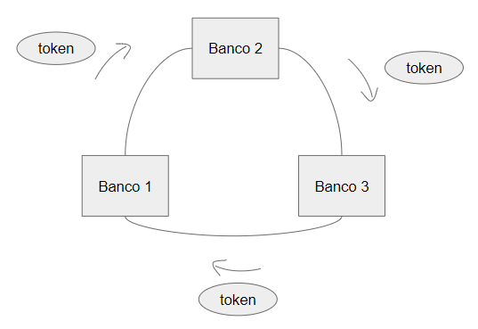
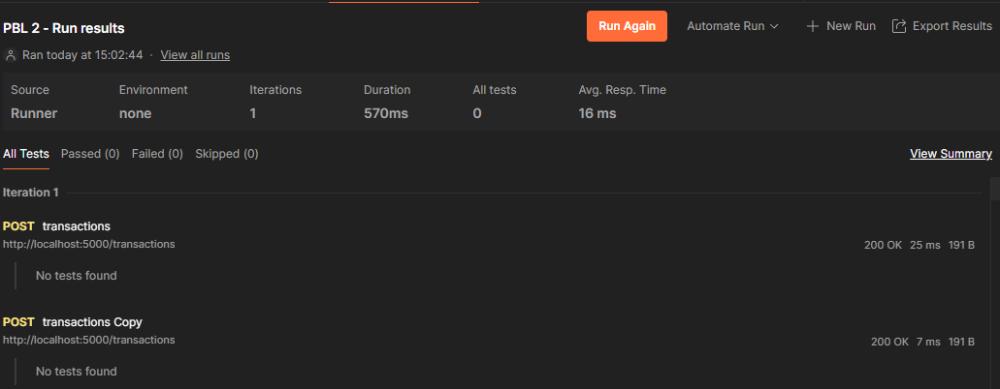

# Relatório do PBL - Internet of Things

## Introdução:

Este relatório tem como objetivo documentar o processo de aprendizado e construção do projeto sobre Transações Bancárias Distribuídas. No presente projeto, foi solicitado o desenvolvimento de um serviço que permita a comunicação entre diferentes bancos na rede de maneira distribuída. Essa abordagem foi utilizada para que o sistema inteiro não dependa de um nó central (como ocorre com o sistema de bancos atual), permitindo assim, uma maior interdependência entre eles.

Para isso, foi decidido que o sistema deveria ser implementado através de API's Rest, facilitando a comunicação entre os diferentes nós (bancos).

A aplicação consiste em uma interface amigável no terminal para o usuário realizar o cadastro, login e logout, depósito em conta, transferência e checagem de saldo.

Dessa forma, os bancos conseguem se comunicar e realizar diferentes transações sem necessitar de um orgão central. Realizando toda a comunicação de maneira distruibuída.

## Resultados e discussões:

O sistema permite a criação de contas de usuário através de uma interface amigável pelo terminal. Para o cliente, basta inserir as informações solicitadas e ralizar o login na conta bancária. Após o login, é possível fazer o depósito em conta, checar o saldo e realizar transações.

No presente projeto, é possível realizar transações entre diferentes bancos. Existem dois tipos de operações: do banco que o cliente está logado para outro; e de outros bancos para outros a partir do banco que o cliente está logado. Para especificar qual tipo de operação o usuário deseja realizar, na criação da transação, quando for perguntado qual o tipo de operação, o cliente pode inserir "this" (para transações partindo desse banco) ou "other" (para transações partindo de outros bancos). Assim, em um exemplo, o usuário está logado no banco 1 e deseja realizar uma transferencia de sua conta neste banco para o banco 2. Assim, na criação da transação, o cliente deve inserir o valor "this" quando for perguntado o tipo de operação. OBS.: O cliente deve inserir as demais informações anteriores para a conclusão da construção da transação.

Os servidores (bancos) utilizam o protocolo de comunicação HTTP, utilizando API's Rest. Cada banco funciona em um IP específico e na mesma porta (5000). Assim, os bancos vão realizando as requisições de criação de transações e transferências entre si. Atendendo assim, um dos requisitos do barema deste projeto.

A sincronização em um único servidor foi implementada utilizando a lógica de Token Ring. Assim, a concorrência em um servidor é tratada, já que somente o banco que detiver o token será capaz de realizar as transações. Explicando melhor a lógica de token ring nesse projeto, o banco 1 é configurado para iniciar o token na rede. Assim, ao iniciar ele tenta passar o token para o próximo nó, nesse caso, o banco 2. Essa lógica se aplica para todo o resto dos nós. Para os demais nós, caso o tempo de espera de recebimento do token seja extrapolado, o próprio banco inicializará um token na rede. Assim, para evitar vários tokens na rede, o tempo de espera de cada banco é diferente com base em seu id no consórcio. Por exemplo, o banco 2 irá aguardar 10 segundos + (id dele) ** 2, assim, sempre um banco somente irá perceber a falta do token da rede, pois os outros terão um tempo maior, pois dependem dos seus respectivos ids. Para visualizar a lógica Token Ring implementada, a figura 1 exemplifica o funcionamento do token com 3 bancos no consórcio.

Figura 1 - Lógica do Token Ring

Então, dessa forma, a concorrência do sistema é tratada, visto que o token é a confirmação de que o banco que o detém pode realizar a transação. Cada transação é independente da outra, elas possuem uma ordem específica conforme a criação delas for ocorrendo. Assim, quando a transação 1 for criada, ela vai ser executada seguidamente da transação 2, e assim por diante. Desse modo, as transações possuem uma ordem de execução e caso alguma dessas não seja possível de ser realizada, ela somente não vai ser finalizada, acatando um dos requisitos do problema,o de transações atômicas. Em síntese, a transação somente ocorre após uma confirmação da requisição, caso não seja possível a formalização da requisição, a transação não ocorre.

Diante disso, o algoritmo está tratando o problema de maneira correta, pois a concorrência é administrada pelo token, dando a vez a cada banco. Ainda assim, foi colocada uma lógica para assegurar que nenhum banco permaneça com o token travado nele se houverem muitas transações. Assim, passando 10 segundos e o token ainda não tiver sido passado adiante, o banco é obrigado a realizar essa ação. Porém, para evitar que uma transação seja interrompida pela metade, atendendo o requisito de transações atômicas, a transação que estiver sendo realizada no momento do limite do prazo estipulado será finalizada por completo. Assegurando assim, que o algoritmo de token ring esteja sendo implementado corretamente e resolvendo de fato o problema em questão.

Para manter um elevado grau de confiabilidade no sistema, foram postos algumas lógicas de prevenção. Caso o banco receba o token, ele terá que passar esse token adiante em algum momento, sendo assim, caso ele não consiga passar esse token para o banco seguinte, ele tentará para o próximo nó e assim por diante. Caso o banco tente passar para todos os nós na rede e não consiga, significa que esse mesmo banco caiu. Assim ele aguarda um novo token chegar até ele. Retornando assim para o sistema.

Outra validação implementada foi a seguinte: quando os bancos notarem que o token não chegou neles em determinado tempo, o banco que perceber essa falta primeiro irá iniciar um novo token na rede novamente.

## Testes Realizados:

Os testes realizados no sistema foram implementados através da ferramenta Postman, lançando várias transações ao mesmo tempo para os bancos e analisando seus resultados. Como as transações de diferentes clientes podem chegar ao mesmo tempo nos bancos, um Lock foi implementado na estrutura que armazena essas transações. Então, caso duas transações ou mais ocorram ao mesmo tempo no banco, a primeira a chegar realiza um lock na estrutura, assim, o sistema cria uma fila para armazenar as demais transações uma a uma. Diante dessa lógica é possível evitar que uma transação se perca ou uma sobreponha a outra no momento das requisições simultâneas.

Abaixo, um teste simples realizado no sistema, onde duas transações ocorrem ao mesmo tempo em um banco:

Figura 2 - Testes de requisições simultâneas

OBS.: Outros testes mais robustos foram realizados, não se resumindo apenas no teste exemplo acima.

## Instalação

- Baixe a aplicação do GitHub:
  - No terminal, rode: 

  `git clone https://github.com/RicardoCamposJr/DBT-PBL.git`

- Entre na pasta "DBT-PBL/"

## Configuração com Docker:

- ### Banco:
  
  - #### 1 - Configurar os endereços dos bancos:
  
    1.1 - Localize a pasta "/bank".

    1.2 - Localize o dicionário "banks" e insira os IPs dos bancos do consórcio em seus respectivos ids. Caso queira que o banco com o IP 192.168.0.1 seja o banco de id 1, coloque-o na chave "1" do dicionário e assim por diante.

        OBS.: O sistema está configurado para funcionar com 3 bancos somente. Caso queira escalonar o número de bancos, adicione mais IPs no dicionário.

  - #### 2 - Construir a imagem docker do banco:

    No terminal, rode o comando:
    `docker build --pull --rm -f "bank\Dockerfile" -t bank-image "bank"`

    Assim, a imagem será construída e será referenciada como "bank-image".

  - #### 3 - Subir o container da imagem docker:

    No terminal, rode o comando:
    `docker run -it -p 5000:5000 --name bank bank-image`

    Assim, a aplicação irá estar disponível para uso no navegador, no endereço:
    `<IP_DA_SUA_MAQUINA>:5000`

    OBS.: Não finalize o terminal, caso isso ocorra, a aplicação irá finalizar.

## Configuração sem Docker:

-  Caso seu computador já possua a linguagem de programação Python.

-  Para rodar a aplicação siga os seguintes passos:
  
    - Banco:
      -  Entre na pasta: "bank/"
      -  No terminal, execute o comando:
      `python app.py`

## 2.1 - Rotas:

  - GET: `<IP_DA_SUA_MAQUINA>:5000/users`
    - Retorna todos os usuários com suas contas.

  - POST: `<IP_DA_SUA_MAQUINA>:5000/user`
    - Cria um usuário.

  - POST: `<IP_DA_SUA_MAQUINA>:5000/deposit`
    - Realiza o depósito em uma conta.

  - POST: `<IP_DA_SUA_MAQUINA>:5000/transfer`
    - Realiza uma transação.
  
  - POST: `<IP_DA_SUA_MAQUINA>:5000/transactions`
    - Cria uma transação para ser executada quando o banco pegar o token.

## 2.1 - Observações adicionais:
- Para otimizar o tempo de testagem do sistema, já estão cadastrados alguns clientes, para evitar ter que realizar o cadastro toda vez que for testar a aplicação.
- Para criar transações é necessário estar logado em uma conta de algum cliente no banco. A lógica da senha não foi implementada, pois a parte mais importante em que o problema foca não depende dessa implementação, sendo algo a mais. Portanto, não é preciso acertar a senha para logar em uma conta, facilitando a testagem do sistema.

## Postman:
-   O arquivo de testes de rotas do Postman está anexado a pasta raiz do projeto:
    - PBL 2.postman_collection.json
      